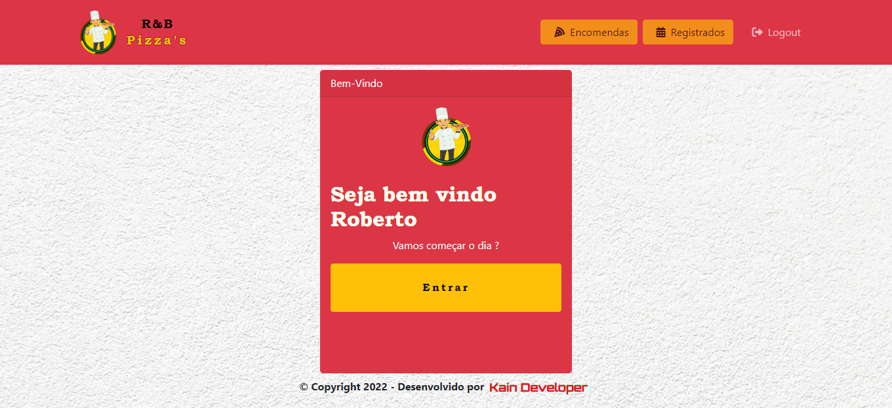
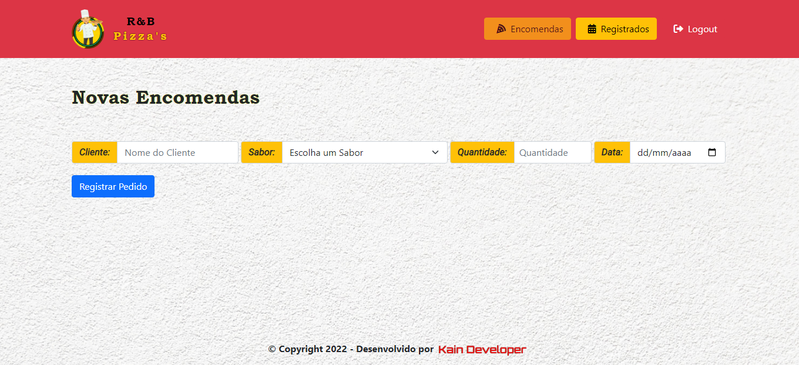
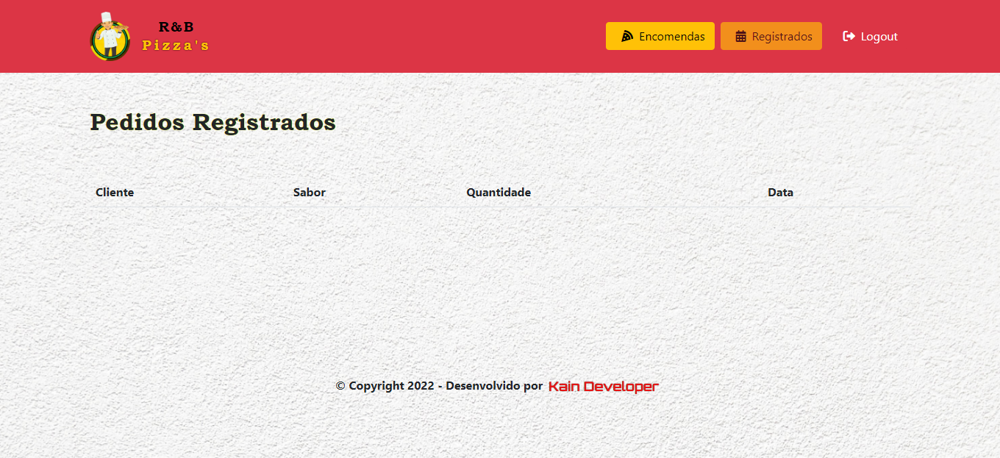

Page with EJS - rbpizzas-order-system  

https://rbpizzas-system.onrender.com/

 
 
 

> Resultado do Portifólio finalizado.

O projeto foi criado em:

- [x] Criação do HTML
- [x] Criação do CSS
- [x] Criação do JavaScript
- [x] Criação do Jquery
- [x] Criação do Bootstrap
- [x] Criação do Template EJS
- [x] Criação do Back-End com NodeJS
- [x] Criação do Banco de dados Mongoose-Atlas (MongoCloud).

Resultado: https://rbpizzas-system.onrender.com/

## 🤝 Colaboradores

Pessoa que contribuiu para este projeto:

<table>
  <tr>
    <td align="center">
      <a href="https://kain-prog.github.io/kain">
         
        
          <b>Matheus Santos [Kain Developer]</b>
        
      </a>
    </td>
   </tr>
</table>
